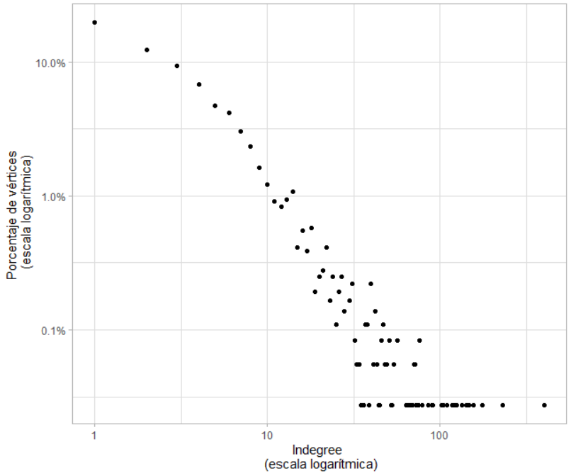
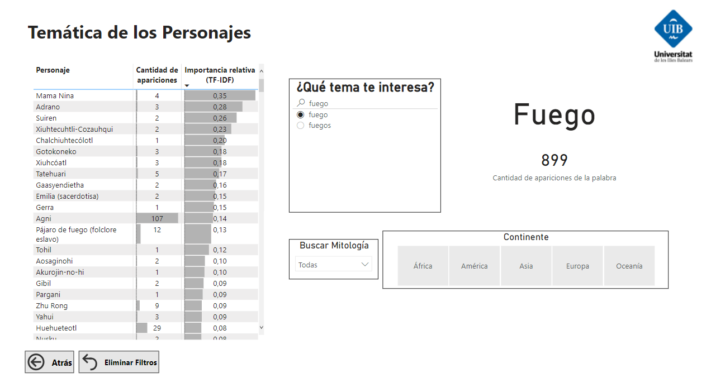
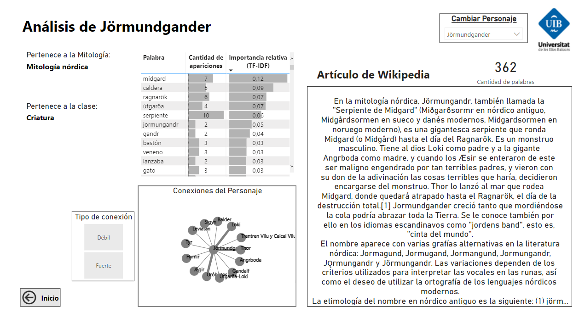
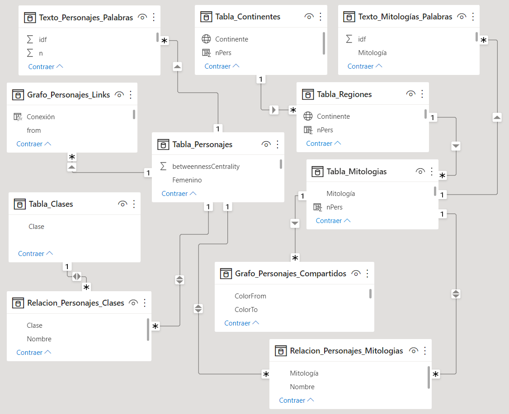

---
output:
  pdf_document: default
classoption: twocolumn
urlcolor: blue
linkcolor: black
header-includes:
   - \usepackage[spanish]{babel}
---

```{r setup, include=FALSE}
knitr::opts_chunk$set(echo = TRUE)
```

\tableofcontents

\newpage

\listoffigures

\newpage


# Resumen

Se ha creado una herramienta con el objetivo de analizar dinámicamente los personajes pertenecientes a las diversas mitologías del mundo. Esta herramienta está publicada en internet y es accesible a través del siguiente [enlace](https://app.powerbi.com/view?r=eyJrIjoiNzhhMjFkM2ItNDRiYS00YWEzLTljODItNjI1NWZiZWU5NWUyIiwidCI6IjcxYmIzNDU4LWQ3NWYtNDcxNi1hNWNiLTY0N2NkYWNiYzBhZiIsImMiOjh9&pageName=ReportSection1770ce719e63217f1c1f).

Todos los datos de las mitologías y personajes mitológicos han sido obtenidos de [Wikipedia](https://es.wikipedia.org/wiki/Wikipedia:Portada). Mediante diversas librerías de scrapeo de Python, se ha creado la base de datos. Después se ha usado el software R para realizar diferentes análisis de grafos y texto, y con los resultados se ha creado un panel en Power BI.

\newpage


# Abstract

We have created a tool to analyze dynamically the mythological characters belonging to mythologies all around the world. This tool is published online and it is accesible through the following [link](https://app.powerbi.com/view?r=eyJrIjoiNzhhMjFkM2ItNDRiYS00YWEzLTljODItNjI1NWZiZWU5NWUyIiwidCI6IjcxYmIzNDU4LWQ3NWYtNDcxNi1hNWNiLTY0N2NkYWNiYzBhZiIsImMiOjh9&pageName=ReportSection1770ce719e63217f1c1f).

Mythologies and characters data have been obtained from [Wikipedia](https://es.wikipedia.org/wiki/Wikipedia:Portada). The data base has been created using various scrapping libraries from Pyhton. We used R software to do the network and text analysis. Finally, with the results we have created a dashboard on Power BI.

\newpage


# Introducción

La mitología tiene una gran influencia en nuestra cultura actual. A pesar de que existen mitos con miles de años de antigüedad, hoy en día no es extraño encontrarse con referencias mitológicas en cualquier ámbito artístico y cultural. Todas las culturas cuentan con sus propios mitos y son un componente indispensable para conocerlas con mayor profundidad. 

Aunque no existe una definición rigurosa de mito, se puede decir que son historias tradicionales que responden cuestiones importantes de manera sencilla. En los mitos aparecen personajes sobrenaturales y las relaciones que mantienen con los seres humanos. Existen cientos de mitologías y una misma mitología puede estar compuesta de hasta cientos de estos personajes mitológicos, cada uno con sus peculiaridades.

A continuación, se explica detalladamente el proceso de creación de una herramienta que tiene como objetivo el análisis de mitologías y personajes mitológicos. Primero se obtiene el conjunto de datos que se utilizará, después se analiza y se obtienen diversas métricas, y finalmente se crean las visualizaciones.


# Obtención del conjunto de datos

Para empezar, es necesario una base de datos con personajes mitológicos. Se puede definir un personaje mitológico cómo un personaje que aparece en los mitos de una cultura, ¿pero qué es exactamente un mito? La definición de mito es bastante difusa, está claro que el mito de Prometeo es un mito, ¿pero qué pasa con el mito de Papá Noel o el del Ratoncito Pérez? ¿Pueden ser considerados mitos de nuestra sociedad moderna?

Actualmente se intentan diferenciar los mitos con las leyendas, las ficciones poéticas y las fábulas, aunque parece que la distinción no está claramente definida, por lo que se sigue teniendo el problema de definir un personaje mitológico. Para obtener el conjunto de datos y solucionar este problema de definición, se acude a Wikipedia.

Wikipedia es una de las plataformas de contenido libre más completas de internet, por lo que es seguro que aparecerán una gran cantidad de los personajes mitológicos que estamos buscando. Utilizando Wikipedia no es necesario proponer una definición de personaje mitológico, ya que es la propia comunidad hispanohablante de Wikipedia la que ha diferenciado lo que es un personaje mitológico de lo que no lo es.

Los artículos de Wikipedia están distribuidos en categorías en función del concepto al que hace referencia cada artículo, por lo que es posible acceder a las categorías de personajes mitológicos y obtener los artículos incluidos. Si un artículo pertenece a una categoría de personaje mitológico, lo identificaremos como tal. Además, el propio nombre de la categoría nos ofrece información importante sobre los personajes que contiene, como la mitología a la que pertenece y el rol que asume dentro de la mitología. Por ejemplo, sabemos que los personajes dentro de la categoría *Criaturas de la mitología nórdica* tienen el rol de "criatura", y pertenecen a la mitología nórdica.

La obtención de los datos se ha realizado en Python. Las librerías usadas para el scrapeo de Wikipedia han sido "BeautifulSoup" y "Selenium".

La primera estrategia para obtener los artículos de los personajes mitológicos consiste en acceder a todas las categorías específicas de personajes mitológicos.

El conjunto de mitologías se ha obtenido de tres listas diferentes de Wikipedia [1](https://es.wikipedia.org/wiki/Especial:%C3%81rbolDeCategor%C3%ADas?target=Mitolog%C3%ADa_por_cultura&mode=all) [2](https://es.wikipedia.org/wiki/Categor%C3%ADa:Mitolog%C3%ADa_por_continente) [3](https://es.wikipedia.org/wiki/Anexo:Deidades). Por otro lado, tras una exploración de las categorías, hemos clasificado los personajes mitológicos entre siete roles distintos: Personaje, Deidad, Criatura, Demonio, Gigante, Héroe y Dragón. Con las combinaciones de estos dos elementos (mitología y rol) se han encontrado la mayoría de las categorías específicas de personajes mitológicos. Existen personajes mitológicos que pertenecen a categorías que no siguen una combinación de los elementos anteriores, esto ocurre por ejemplo con la categoría *Titanes*, que son deidades de la mitología griega. Por lo tanto, para completar el conjunto de datos, se han añadido estas categorías manualmente ([Apéndice 1]). Una vez se tienen todas las categorías, se obtienen todos los personajes pertenecientes a ellas.

La segunda estrategia consiste en encontrar personajes que se encuentren en diversas categorías simultáneamente. Por ejemplo, si un artículo que pertenece tanto a la categoría *Gigante* como a la categoría *Mitología mexica*, sabemos que ese artículo pertenece a un personaje con el rol de "gigante" de la mitología mexica.

Con la metodología anterior se ha obtenido una gran cantidad de artículos de Wikipedia de personajes mitológicos, la mitología a la que pertenecen, y el rol que tienen. Algunos personajes importantes han sido añadidos manualmente debido a que la gran variabilidad de categorías que no son exclusivas de personajes mitológicos. Se extrae el texto de los artículos de los personajes (ignorandose algunos apartados como "Véase también", "Bibliografía",...) para realizar el análisis de texto, y también se obtienen los enlaces a artículos de otros personajes mitológicos para realizar el análisis de grafos. Además se tiene información de que un personaje es femenino debido a que hay categorías que contienen únicamente "Diosas". Esta variable está claramente sesgada: existen personajes femeninos que únicamente pertenecen a una categoría de género neutro, por lo que a priori no se puede saber si se trata de un personaje femenino. A pesar de ello, puede ser interesante filtrar los resultados para los personajes que sabemos con total seguridad que son femeninos.

La región y el continente de la mitología son atributos que nos pueden interesar en el análisis. Para ello, creamos sus tablas correspondientes a partir de esta [lista](https://en.wikipedia.org/wiki/List_of_mythologies) en la que se relacionan mitologías, regiones y continentes. Aquí no aparecen todas las mitologías obtenidas anteriormente, por lo que se añaden manualmente las regiones a las mitologías restantes.

Con todo esto, ya tenemos nuestro modelo de datos ([Apéndice 2]). Está compuesto por la tabla de clases (roles), tabla de personajes, tabla de mitologías, tabla de regiones y tabla de continentes. También hay dos tablas que relacionan la tabla de personajes con las tablas de clases y mitologías debido a que tienen relaciones m:n, es decir, un personaje puede tener más de un rol y pertenecer a más de una mitología (y evidentemente un rol o una mitología contiene más de un personaje).


# Análisis de grafos y texto

Para crear la herramienta de análisis de personajes mitológicos, debemos añadir a la base de datos los resultados de los análisis de grafos y texto ([Apéndice 3]). En total se añaden cuatro nuevas tablas y nuevas variables a la tabla de personajes.

La creación y transformación de estas tablas se ha realizado en R. Se ha usado la librería "igraph" para el análisis de grafos y "tidytext" para el análisis de texto.


### Relación entre las mitologías

Un personaje puede pertenecer a diversas mitologías, por esto mismo se ha creado una nueva tabla que contiene la cantidad de personajes que comparte cada par de mitologías. Esto es considerado como una medida de semejanza entre las mitologías, por lo que será usado para la visualización de un grafo.


### Relación entre los personajes

Además del modelo de datos comentado anteriormente, se han extraido los enlaces entre los diferentes artículos de Wikipedia de los personajes mitológicos. Si un personaje tienen un enlace al artículo de otro personaje, están relacionados. Con esto se ha creado una nueva tabla con las relaciones entre los personajes para realizar visualizaciones de grafos.

Se ha creado un grafo dirigido utilizando estas relaciones entre los personajes. Este grafo está formado por 3.622 nodos (personajes) y 18.852 aristas (relaciones entre personajes). Es un grafo no conexo con 315 componentes. El orden del mayor componente es de 3277 (90% de los nodos), por lo que se puede decir que el grafo tiene un componente gigante. Es un grafo poco denso (el 0.14% de las aristas posibles están definidas), aunque no se puede decir que sea sparse.

Parece que el grafo tiene una estructura "scale-free", es decir, unos pocos personajes tienen muchas relaciones aunque generalmente se trata de un grafo poco denso. La distribución de grados de los nodos sigue una "power-law", esto es un indicio de la estructura "scale-free".



Un personaje mitológico está relacionado (indegree), de media, con otros 5 personajes mitológicos.

Se han obtenido diferentes medidas de centralidad de los nodos: el Page Rank y el Betweenness centrality. Estas métricas pueden ser usadas como índices de importancia de los personajes, por lo que se añaden la tabla de personajes de la base de datos.


### Análisis de texto

El análisis de texto se ha realizado tanto para analizar los personajes como las mitologías, por lo que se han obtenido dos tablas diferentes.

Para el análisis de los personajes se ha usado el corpus formado por el texto en los artículos de los personajes. Se han eliminado las stopwords típicas obtenidas de diversas fuentes, los nombres de los personajes, los nombres de las mitologías y algunas palabras que aparecen como texto auxiliar en Wikipedia ("cita", "requerida" y "editar"). Una vez hecho esto, se crea una tabla con la frecuencia y el "term frequency - inverse document frecuency" (tf-idf) para cada combinación de personaje-palabra.

Se crea otra tabla similar usando la misma metodología, pero agregando los textos de los artículos por mitologías.

Con estas tablas es posible analizar el uso de los términos más usados en los artículos de Wikipedia. Además, con el uso del tf-idf, podemos descubrir cuáles son los términos que caracterizan a un personaje o mitología.


# Visualización de los resultados

Se ha creado una herramienta de visualización de los resultados obtenidos utilizando el software Power BI de Microsoft. El resultado está publicado en la web y puede encontrarse en el siguiente [link](https://app.powerbi.com/view?r=eyJrIjoiNzhhMjFkM2ItNDRiYS00YWEzLTljODItNjI1NWZiZWU5NWUyIiwidCI6IjcxYmIzNDU4LWQ3NWYtNDcxNi1hNWNiLTY0N2NkYWNiYzBhZiIsImMiOjh9&pageName=ReportSection1770ce719e63217f1c1f).

El informe de visualización cuenta principalmente con 6 páginas diferentes: (1) Exploración de la Base de Datos, (2) Relación entre Mitologías, (3) Relación entre Personajes, (4) Temática de los Personajes, (5) Análisis de Mitología y (6) Análisis de Personaje.


### Exploración de la Base de Datos


Con esta primera página se puede explorar fácilmente el conjunto de los datos. Se puede observar la cantidad mitologías y de personajes totales, la cantidad de personajes por mitología, por región, por continente y por clase. También se pueden ver los índices de importancia de cada personaje (Page Rank y Betweenness Centrality), la cantidad de palabras en el corpus (no se cuentan las stopwords eliminadas anteriormente), y la cantidad de apariciones de cada palabra.

Es posible acceder directamente a un análisis de cualquier mitología, personaje o palabra desde las tablas.

Para las anteriores visualizaciones, se pueden filtrar los personajes por continente, región, rol del personaje y género femenino.


### Relación entre Mitologías


La visualización principal de esta página es un grafo con las relaciones entre las distintas mitologías. Dos mitologías están relacionadas si comparten algún personaje mitológico. Se puede cambiar la cantidad mínima de personajes compartidos entre las mitologías para que exista una relación entre ellas. También se puede filtrar por una mitología o continente específico. Al mismo tiempo existe una tabla en la que se observa el peso de las relaciones entre las mitologías.


### Relación entre Personajes


En esta página se encuentra el grafo con las relaciones entre los personajes analizado en el apartado anterior. La relación entre dos personajes puede ser débil o fuerte dependiendo de si la dirección del enlace es unidireccional o bidireccional. Se puede filtrar el grafo por personaje, mitología, continente y tipo de relación.

Si no se aplica ningún filtro, no aparecen todos los personajes dentro de la visualización del grafo debido a la limitación de cantidad de aristas de la herramienta. Cuando se supera el límite máximo de aristas impresas, aparece una señal de aviso en la visualización.


### Temática de los Personajes



Página de análisis de las palabras. El objetivo de esta página es encontrar los personajes mitológicos que tengan mayor relación con la palabra de interés. Se inserta una palabra como input y aparecen los personajes con mayor valor tf-idf en relación a esa palabra. También aparece la cantidad de apariciones de la palabra.

Los personajes pueden filtrarse tanto por mitología como por continente.


### Análisis de Mitología


Página de análisis de las mitologías. En esta página se observa la cantidad de personajes de la mitología, los personajes de la mitología con sus índices de importancia, las mitologías relacionadas, las palabras más importantes de la mitología (tanto frecuencia como tf-idf) y el grafo de relaciones entre los personajes de la mitología. Se pueden filtrar este grafo en función del tipo de relación (débil o fuerte) y cambiar de mitología analizada.


### Análisis de Personaje



Página de análisis de los personajes. Se puede observar tanto la mitología a la que pertenece el personaje como su rol. También se observa la frecuencia y el tf-idf de las palabras que aparecen en el artículo del personaje, el texto del artículo y el grafo con las relaciones que tiene con otros personajes. Se puede cambiar el tipo de relación que  se observa en el grafo y el personaje analizado.


# Conclusiones

En este trabajo se ha creado una herramienta útil para explorar y analizar personajes mitológicos y mitologías utilizando únicamente datos de Wikipedia. Se han desarrollado todas las etapas del proceso de creación de la herramienta: Extracción de los personajes de Wikipedia, modelado, análisis y visualización de los datos en web. Todo ello con el uso de diferentes tipos de software en función de cada necesidad específica, principalmente Python para el scrapeo de los datos, R para el análisis, y Power BI para la visualización de los resultados.

Se ha visto que casi un tercio de los personajes pertenecen a la mitología griega. Este sesgo seguramente se deba a que es la mitología más popular en la sociedad hispanohablante, por lo que sería interesante obtener datos similares con los artículos de Wikipedia de otros idiomas y analizar sus diferencias.

En este [repositorio de GitHub](https://github.com/sergifornes/tfm-mitico) se pueden encontrar todos los archivos referentes a este trabajo: El scrapeo en Pyton, los datos, el análisis en R, y la visualización en Power BI.


# Bibliografía

\setlength{\parindent}{-0.2in}
\setlength{\leftskip}{0.2in}
\setlength{\parskip}{8pt}

García Gual, C. (1992). Introducción a la mitología griega. Alianza Editorial.

Kirk, G. S. (1970). El mito. Paidós.

Silge, J. y Robinson, D. (2017). Text Mining with R: A Tidy Approach. O'Reilly. https://www.tidytextmining.com/

\newpage


# Apéndice 1

#### Mitología griega
\ \
[Conceptos personificados (deidad)](https://es.wikipedia.org/wiki/Categoría:Conceptos_personificados_de_la_mitología_griega)  
[Grayas (diosa)](https://es.wikipedia.org/wiki/Categoría:Grayas)  
[Horas (diosa)](https://es.wikipedia.org/wiki/Categoría:Personajes_de_la_mitología_griega)  
[Oceánidas (dios)](https://es.wikipedia.org/wiki/Categoría:Oceánidas)  
[Ourea (deidad)](https://es.wikipedia.org/wiki/Categoría:Ourea)  
[Autómatas (criatura)](https://es.wikipedia.org/wiki/Categoría:Autómatas_de_la_mitología_griega)  
[Centauros (criatura)](https://es.wikipedia.org/wiki/Categoría:Centauros)  
[Monstruos (criatura)](https://es.wikipedia.org/wiki/Categoría:Monstruos_de_la_mitología_griega)  
[Harpías (criatura)](https://es.wikipedia.org/wiki/Categoría:Harpías)  
[Sátiros (criatura)](https://es.wikipedia.org/wiki/Categoría:Sátiros)  
[Diosas del mar (diosa)](https://es.wikipedia.org/wiki/Categoría:Diosas_del_mar_de_la_mitología_griega)  
[Nereidas (diosa)](https://es.wikipedia.org/wiki/Categoría:Nereidas)  
[Oceánides (diosa)](https://es.wikipedia.org/wiki/Categoría:Oceánides)  
[Erinias (diosa)](https://es.wikipedia.org/wiki/Categoría:Erinias)  
[Musas (diosa)](https://es.wikipedia.org/wiki/Categoría:Musas)  
[Ninfas (diosa)](https://es.wikipedia.org/wiki/Categoría:Ninfas)  
[Dríades (diosa)](https://es.wikipedia.org/wiki/Categoría:Dríades)  
[Náyades (diosa)](https://es.wikipedia.org/wiki/Categoría:Náyades)  
[Pléyades (diosa)](https://es.wikipedia.org/wiki/Categoría:Pléyades)  
[Dioses ctónicos (deidad)](https://es.wikipedia.org/wiki/Categoría:Dioses_ctónicos_del_panteón_griego)  
[Dioses del mar (dios)](https://es.wikipedia.org/wiki/Categoría:Dioses_del_mar_de_la_mitología_griega)  
[Dioses olímpicos (deidad)](https://es.wikipedia.org/wiki/Categoría:Dioses_olímpicos)  
[Dioses olímpicos menores (deidad)](https://es.wikipedia.org/wiki/Categoría:Dioses_olímpicos_menores)  
[Dioses primordiales (deidad)](https://es.wikipedia.org/wiki/Categoría:Dioses_primordiales_de_la_mitología_griega)  
[Titanes (deidad)](https://es.wikipedia.org/wiki/Categoría:Titanes)  
[Dioses del viento (deidad)](https://es.wikipedia.org/wiki/Categoría:Dioses_del_viento_de_la_mitología_griega)  
[Deidades (deidad)](https://es.wikipedia.org/wiki/Categoría:Deidades_de_la_mitología_griega)  

#### Mitología nórdica
\ \
[Caballos (criatura)](https://es.wikipedia.org/wiki/Categoría:Caballos_de_la_mitología_nórdica)  
[Lobos (criatura)](https://es.wikipedia.org/wiki/Categoría:Lobos_de_la_mitología_nórdica)  
[Ásynjur (diosa)](https://es.wikipedia.org/wiki/Categoría:Ásynjur)  
[Nornas (diosa)](https://es.wikipedia.org/wiki/Categoría:Nornas)  
[Æsir (dios)](https://es.wikipedia.org/wiki/Categoría:Æsir)  
[Valquirias (diosa)](https://es.wikipedia.org/wiki/Categoría:Valquirias)  
[Vanir (deidad)](https://es.wikipedia.org/wiki/Categoría:Vanir)  
[Enanos (criatura)](https://es.wikipedia.org/wiki/Categoría:Enanos_en_la_mitología_nórdica)  
[Jotuns (gigante)](https://es.wikipedia.org/wiki/Categoría:Jotuns)  

#### Mitología hinduista
\ \
[Avatares (personaje)](https://es.wikipedia.org/wiki/Categoría:Avatares_del_hinduismo)  
[Deidades rigvédicas (deidad)](https://es.wikipedia.org/wiki/Categoría:Deidades_rigvédicas)  
[Razas no humanas (personaje)](https://es.wikipedia.org/wiki/Categoría:Razas_no_humanas_en_la_mitología_hindú)  
[Apsará (diosa)](https://es.wikipedia.org/wiki/Categoría:Apsará)  
[Demonios (demonio)](https://es.wikipedia.org/wiki/Categoría:Demonios_en_el_hinduismo)  
[Ráksasas (demonio)](https://es.wikipedia.org/wiki/Categoría:Ráksasas)  

#### Mitología japonesa
\ \
[Divinidades sintoistas (deidad)](https://es.wikipedia.org/wiki/Categoría:Divinidades_sintoistas)  
[Yōkai (criatura)](https://es.wikipedia.org/wiki/Categor%C3%ADa:Y%C5%8Dkai)  
[Myō-ō (deidad)](https://es.wikipedia.org/wiki/Categor%C3%ADa:My%C5%8D-%C5%8D)  

#### Mitología ainu
\ \
[Kamui (deidad)](https://es.wikipedia.org/wiki/Categoría:Kamui)  

#### Mitología budista
\ \
[Ráksasas (demonio)](https://es.wikipedia.org/wiki/Categoría:Ráksasas)  
[Criaturas (criatura)](https://es.wikipedia.org/wiki/Categoría:Criaturas_mitológicas_del_budismo)  
[Deidades femeninas (diosa)](https://es.wikipedia.org/wiki/Categoría:Deidades_femeninas_en_el_budismo)  
[Dakinis (diosa)](https://es.wikipedia.org/wiki/Categoría:Dakinis)  
[Deidades del budismo tibetano (deidad)](https://es.wikipedia.org/wiki/Categoría:Deidades_del_budismo_tibetano)  
[Dharmapalas (deidad)](https://es.wikipedia.org/wiki/Categoría:Dharmapalas)  
[Myō-ō (deidad)](https://es.wikipedia.org/wiki/Categor%C3%ADa:My%C5%8D-%C5%8D)  
[Devas (deidad)](https://es.wikipedia.org/wiki/Categoría:Devas_(budismo))  
[Seres (personaje)](https://es.wikipedia.org/wiki/Categoría:Seres_de_la_mitología_budista)  

#### Mitología mexica
\ \
[Criaturas (criatura)](https://es.wikipedia.org/wiki/Categoría:Criaturas_mexicas)  
[Cihuateteo (diosa)](https://es.wikipedia.org/wiki/Categoría:Cihuateteo)  
[Macuiltonaleque (dios)](https://es.wikipedia.org/wiki/Categoría:Macuiltonaleque)  
[Deidades del amor y la fertilidad (deidad)](https://es.wikipedia.org/wiki/Categoría:Deidades_del_amor_y_la_fertilidad_mexica)  
[Centzon Huitznáhuac (deidad)](https://es.wikipedia.org/wiki/Categoría:Centzon_Huitznáhuac)  
[Centzon Totochtin (deidad)](https://es.wikipedia.org/wiki/Categoría:Centzon_Totochtin)  
[Cinteteo (dios)](https://es.wikipedia.org/wiki/Categoría:Cinteteo)  
[Conceptos personificados (deidad)](https://es.wikipedia.org/wiki/Categoría:Conceptos_personificados_de_la_mitología_mexica)  
[Dioses del viento (deidad)](https://es.wikipedia.org/wiki/Categoría:Dioses_del_viento_de_la_mitología_mexica)  
[Dioses primordiales (deidad)](https://es.wikipedia.org/wiki/Categoría:Dioses_primordiales_de_la_mitología_mexica)  
[Divinidades de la muerte (deidad)](https://es.wikipedia.org/wiki/Categoría:Divinidades_de_la_muerte_de_la_mitología_mexica)  
[Tezcatlipocas (deidad)](https://es.wikipedia.org/wiki/Categoría:Tezcatlipocas)  
[Tlaloque (deidad)](https://es.wikipedia.org/wiki/Categoría:Tlaloque)  
[Tonalteteuctin (deidad)](https://es.wikipedia.org/wiki/Categoría:Tonalteteuctin)  

#### Mitología china
\ \
[Los ocho inmortales (deidad)](https://es.wikipedia.org/wiki/Categoría:Los_ocho_inmortales)  
[Tres augustos y cinco emperadores (personaje)](https://es.wikipedia.org/wiki/Categoría:Tres_augustos_y_cinco_emperadores)  

#### Mitología celta
\ \
[Deidades britanas (deidad)](https://es.wikipedia.org/wiki/Categoría:Deidades_britanas)  
[Fomorianos (deidad)](https://es.wikipedia.org/wiki/Categoría:Fomorianos)  
[Tuatha Dé Danann (deidad)](https://es.wikipedia.org/wiki/Categoría:Tuatha_Dé_Danann)  

#### Mitología irlandesa
\ \
[Fomorianos (deidad)](https://es.wikipedia.org/wiki/Categoría:Fomorianos)  
[Tuatha Dé Danann (deidad)](https://es.wikipedia.org/wiki/Categoría:Tuatha_Dé_Danann)  

#### Mitología yoruba
\ \
[Orisha (deidad)](https://es.wikipedia.org/wiki/Categoría:Orisha)  

#### Mitología del judaísmo
\ \
[Criaturas (criatura)](https://es.wikipedia.org/wiki/Categoría:Criaturas_legendarias_judías)  
[Ángeles (criatura)](https://es.wikipedia.org/wiki/Categoría:Ángeles_en_el_judaísmo)  

#### Mitología persa
\ \
[Daevas (demonio)](https://es.wikipedia.org/wiki/Categoría:Daevas)  
[Yazatas (deidad)](https://es.wikipedia.org/wiki/Categoría:Yazatas)  

#### Mitología cántabra
\ \
[Criaturas (criatura)](https://es.wikipedia.org/wiki/Categoría:Criaturas_del_folclore_de_Cantabria)  

#### Mitología asturiana
\ \
[Criaturas (criatura)](https://es.wikipedia.org/wiki/Categoría:Criaturas_del_folclore_de_Asturias)  

#### Mitología de América del Norte
\ \
[Criaturas (criatura)](https://es.wikipedia.org/wiki/Categoría:Criaturas_legendarias_de_los_pueblos_indígenas_de_América_del_Norte)  

#### Mitología de Oriente Medio
\ \
[Criaturas (criatura)](https://es.wikipedia.org/wiki/Categoría:Criaturas_legendarias_de_Oriente_Medio)  
[Dioses (deidad)](https://es.wikipedia.org/wiki/Categoría:Dioses_del_Oriente_Medio)  
[Diosas elamitas (diosa)](https://es.wikipedia.org/wiki/Categoría:Diosas_elamitas)  
[Dioses elamitas (dios)](https://es.wikipedia.org/wiki/Categoría:Dioses_elamitas)  

#### Mitología del islam
\ \
[Criaturas (criatura)](https://es.wikipedia.org/wiki/Categoría:Criaturas_mitológicas_islámicas)  
[Ángeles (criatura)](https://es.wikipedia.org/wiki/Categoría:Ángeles_en_el_islam)

\newpage


# Apéndice 2


\newpage


# Apéndice 3




